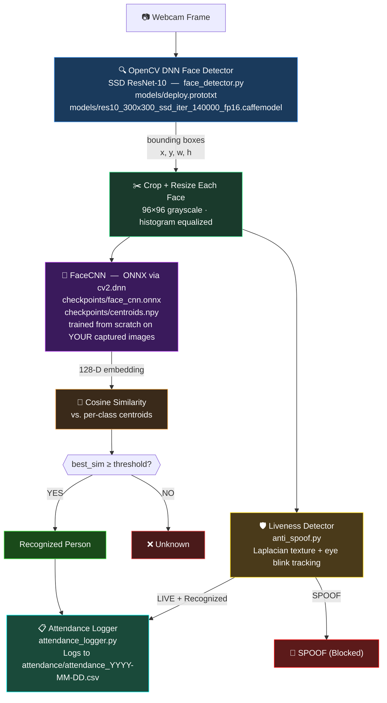

# Multi-Face Recognition System (Trained From Scratch)

A real-time, multi-face recognition pipeline built without any pretrained
identity models. Features **face anti-spoofing (liveness detection)**, **automated CSV attendance logging**, and pure **OpenCV DNN** inference — no PyTorch runtime needed during live recognition.

---

## 1. Architecture overview



**Key Components:**

| Stage | Component | File | Nature |
|:---|:---|:---|:---|
| Detection ("where is a face?") | OpenCV DNN SSD ResNet-10 | `face_detector.py` | Pre-trained face localizer — NOT trained on identities |
| Recognition ("whose face is it?") | FaceCNN → ONNX → cv2.dnn | `model.py`, `recognize_live.py` | Trained 100% from scratch on your captured data |
| Anti-Spoofing ("is it a real person?") | Texture + Blink Tracking | `anti_spoof.py` | Pure OpenCV — checks micro-texture & eye blinks |
| Attendance ("log entry") | CSV Logger with Cooldown | `attendance_logger.py` | Generates daily CSV files (`attendance/attendance_YYYY-MM-DD.csv`) |

---

## 2. End-to-end workflow (4 steps)

```
Step 1         Step 2         Step 3          Step 4
capture        train          export          recognize
_face.py  →  train_model  →  export_model  →  recognize
  ↓            .py              .py             _live.py
dataset/      checkpoints/    checkpoints/    Live camera + Anti-Spoof
<name>/       face_cnn.pt     face_cnn.onnx   + CSV Attendance Log
*.png         centroids       centroids.npy
              classes.json    classes.json
```

> ⚠️ **Always run `export_model.py` after every `train_model.py` run.**
> The ONNX + centroids must stay in sync with `classes.json`.

---

## 3. Setup

```powershell
python -m venv venv
venv\Scripts\activate
pip install -r requirements.txt
```

The `models/` directory already contains the DNN face detector files:
- `models/deploy.prototxt`
- `models/res10_300x300_ssd_iter_140000_fp16.caffemodel`

---

## 4. Step-by-step usage

### Step 1 — Capture faces (repeat per person)

```powershell
# Webcam (auto-detects index 0, 1, 2...)
python capture_face.py --name alice
python capture_face.py --name bob

# DroidCam (phone as wireless camera)
python capture_face.py --name alice --droidcam 192.168.1.5
```

**Tips for best accuracy:**
- Move your head (left/right/up/down), vary expressions and distance.
- Capture under **different lighting conditions** (indoor, near window, etc).
- Aim for **250 images per person** (default `--num_images 250`).
- Minimum **2 people** required — the model needs multiple classes.
- Only saves when **exactly one face** is detected — prevents mislabeling.
- Re-running for the same person **appends** images, not overwrites.

### Step 2 — Train the CNN

```powershell
python train_model.py --epochs 30
```

- Training output shows `train_loss`, `train_acc`, `val_acc` per epoch.
- Checkpoint saves **only when `val_acc` improves** — always the best model.
- Typical time: **3–15 min on CPU**, under a minute on GPU.
- `val_acc 1.000` by epoch ~5 is normal for a small, well-captured dataset.

### Step 3 — Export to ONNX

```powershell
python export_model.py
```

Converts the trained PyTorch model to ONNX format and saves:
- `checkpoints/face_cnn.onnx` — model for `cv2.dnn` inference
- `checkpoints/centroids.npy` — per-class centroid embeddings
- `checkpoints/classes.json` — class index → name mapping

**Run this every time after training.** If you forget, `recognize_live.py`
will detect the mismatch and print a clear error.

### Step 4 — Run live recognition + attendance + anti-spoofing

```powershell
# Standard run (webcam)
python recognize_live.py --camera 1

# DroidCam
python recognize_live.py --droidcam 192.168.1.5

# Debug mode: prints cosine scores & texture scores per frame
python recognize_live.py --camera 1 --debug

# Custom options:
python recognize_live.py --camera 1 --threshold 0.35 --attendance_cooldown 120
python recognize_live.py --camera 1 --no_spoof      # disable anti-spoofing
python recognize_live.py --camera 1 --no_attendance # disable attendance logging
```

Press `q` to quit.

---

## 5. Attendance & Anti-Spoofing Details

### 🛡️ Anti-Spoofing (Liveness Detection)
- **Texture Analysis (Laplacian Variance):** Real faces have complex skin micro-texture. Flat phone screens or paper photos have low texture scores and get flagged as `SPOOF`.
- **Temporal Eye Blink Tracking:** Uses OpenCV's `haarcascade_eye` to track state changes over a rolling window. Static photos (where eyes never change state) fail the liveness check.

### 📋 Attendance Logging
- Daily CSV files created automatically under `attendance/attendance_YYYY-MM-DD.csv`.
- **Cooldown protection:** Default `60s` cooldown per person prevents duplicate logs if someone stays in front of the camera.
- Attendance is logged **ONLY** when a face is both **Recognized AND Live**.

---

## 6. Calibrating the threshold

The `--threshold` is a **cosine similarity** value (0.0 – 1.0):

| Behavior | Action |
|:---|:---|
| Known person showing as "Unknown" | **Lower** threshold (e.g. `0.25`) |
| Unknown stranger being matched | **Raise** threshold (e.g. `0.60`) |

**Use `--debug` to see actual scores:**
```
[DEBUG] alice:0.741, bob:0.123  | threshold=0.30
[LIVENESS] fid=12_15_4_4  texture=112.4  live=True
```

Default threshold: `0.30`. A good starting range is `0.25 – 0.55`.

---

## 7. Adding a new person later

```powershell
python capture_face.py --name charlie
python train_model.py --epochs 30
python export_model.py
python recognize_live.py --camera 1
```

---

## 8. Dataset layout

```
dataset/
├── alice/
│   ├── 0000.png   ┐
│   ├── 0001.png   │  96×96 grayscale PNG (lossless)
│   ├── ...        │  histogram-equalized face crop
│   └── 0249.png   ┘  folder name = label
├── bob/
│   ├── 0000.png
│   └── ...
└── charlie/
    └── ...
```

---

## 9. File structure

```
Multi_Face/
├── requirements.txt            # pip dependencies
├── face_detector.py            # OpenCV DNN SSD face detector wrapper
├── anti_spoof.py               # Liveness / Anti-spoofing detector (texture + blink)
├── attendance_logger.py        # CSV attendance logger with per-person cooldown
├── model.py                    # FaceCNN architecture (PyTorch)
├── capture_face.py             # Step 1: Build your dataset
├── train_model.py              # Step 2: Train from scratch (PyTorch)
├── export_model.py             # Step 3: Export to ONNX for cv2.dnn
├── recognize_live.py           # Step 4: Live inference (pure OpenCV DNN)
├── models/
│   ├── deploy.prototxt                              # DNN face detector config
│   └── res10_300x300_ssd_iter_140000_fp16.caffemodel  # DNN face detector weights
├── dataset/                    # Created by capture_face.py
│   └── <name>/*.png
├── checkpoints/                # Created by train_model.py + export_model.py
│   ├── face_cnn.pt             # PyTorch weights (training)
│   ├── face_cnn.onnx           # ONNX model (inference via cv2.dnn)
│   ├── centroids.npy           # Per-class centroid embeddings
│   └── classes.json            # Index → person name mapping
└── attendance/                 # Created by attendance_logger.py
    └── attendance_YYYY-MM-DD.csv
```

---

## 10. Design notes

- **Why OpenCV DNN for detection**: Haar Cascade (the 2001 Viola-Jones method) misses angled faces, struggles in low light, and produces many false positives. The SSD ResNet-10 model is a small, pre-trained face localizer — it detects "is there a face here?" without ever knowing *whose* face it is.
- **Why cosine centroids instead of softmax at inference**: Softmax always picks the most likely known class even for a complete stranger. Cosine similarity against class centroids allows genuine "Unknown" rejection when the face embedding doesn't cluster near any trained identity.
- **Why ONNX + cv2.dnn at inference**: PyTorch is needed for training (autograd, backprop) but is a large runtime dependency (~700MB). Exporting to ONNX and running via `cv2.dnn` keeps live inference lightweight — no PyTorch import during recognition.
- **Why anti-spoofing + attendance**: Adding liveness detection prevents trivial spoofing with phone screen images, while daily CSV attendance logging turns this pipeline into a complete, usable real-time biometric application.